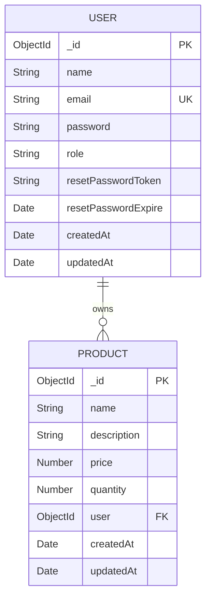

# Diagrama Entidad-Relación - Sistema de Gestión de Productos

## 📊 Descripción del Modelo de Datos

El sistema de gestión de productos utiliza una base de datos NoSQL (MongoDB) con un diseño orientado a documentos que optimiza el rendimiento y la escalabilidad.

---

## 🗄️ Entidades Principales

### 1. Usuario (User)
Representa a los usuarios del sistema con capacidad para autenticarse y gestionar productos.

```javascript
{
  _id: ObjectId,
  name: String,           // Nombre del usuario
  email: String,          // Email único para autenticación
  password: String,       // Contraseña encriptada
  role: String,           // Rol: 'user' | 'admin'
  resetPasswordToken: String,  // Token para recuperación de contraseña
  resetPasswordExpire: Date,   // Expiración del token de recuperación
  createdAt: Date,        // Fecha de creación
  updatedAt: Date         // Fecha de última actualización
}
```

### 2. Producto (Product)
Representa los artículos que los usuarios pueden gestionar en su inventario.

```javascript
{
  _id: ObjectId,
  name: String,           // Nombre del producto
  description: String,    // Descripción detallada
  price: Number,          // Precio del producto
  quantity: Number,       // Cantidad disponible
  user: ObjectId,        // Referencia al usuario propietario
  createdAt: Date,        // Fecha de creación
  updatedAt: Date         // Fecha de última actualización
}
```

---

## 🔗 Relaciones entre Entidades

### Relación Usuario-Producto
- **Tipo**: Uno a Muchos (1:N)
- **Descripción**: Un usuario puede tener múltiples productos, pero cada producto pertenece a un único usuario.
- **Implementación**: Referencia mediante ObjectId en el documento Product.

```
Usuario (1) ──────── (N) Productos
   │                     │
   │ tiene               │ pertenece a
   │                     │
   └─────────────────────┘
```

---

## 📈 Diagrama Visual



---

## 🎯 Índices y Optimización

### Índices Primarios
- **User._id**: Índice único por defecto de MongoDB
- **Product._id**: Índice único por defecto de MongoDB

### Índices Secundarios
```javascript
// Colección User
db.users.createIndex({ "email": 1 }, { unique: true })  // Email único
db.users.createIndex({ "role": 1 })                      // Para consultas por rol

// Colección Product
db.products.createIndex({ "user": 1 })                   // Para productos por usuario
db.products.createIndex({ "name": "text" })             // Búsqueda de texto
db.products.createIndex({ "price": 1 })                 // Ordenamiento por precio
db.products.createIndex({ "createdAt": -1 })            // Ordenamiento por fecha
```

### Índices Compuestos
```javascript
// Para consultas frecuentes de productos por usuario y nombre
db.products.createIndex({ "user": 1, "name": 1 })

// Para consultas de productos por usuario y precio
db.products.createIndex({ "user": 1, "price": 1 })
```

---

## 🔒 Consideraciones de Seguridad

### Encriptación de Datos
- **Contraseñas**: Encriptadas con bcrypt (salt rounds: 10)
- **Tokens JWT**: Firmados con clave secreta configurable
- **Comunicación**: HTTPS en producción

### Validaciones de Datos
```javascript
// Usuario
email: {
  required: true,
  unique: true,
  match: [/^\w+([\.-]?\w+)*@\w+([\.-]?\w+)*(\.\w{2,3})+$/, 'Email inválido']
}

// Producto
price: {
  required: true,
  min: [0, 'El precio no puede ser negativo']
}
quantity: {
  required: true,
  min: [0, 'La cantidad no puede ser negativa']
}
```

---

## 📊 Estadísticas y Consultas Típicas

### Consultas Frecuentes
1. **Productos por usuario**: `db.products.find({ user: userId })`
2. **Búsqueda de productos**: `db.products.find({ name: /keyword/i })`
3. **Productos por rango de precio**: `db.products.find({ price: { $gte: min, $lte: max } })`
4. **Usuario por email**: `db.users.findOne({ email: userEmail })`

### Agregaciones
```javascript
// Total de productos por usuario
db.products.aggregate([
  { $group: { _id: "$user", total: { $sum: 1 } } }
])

// Valor total del inventario por usuario
db.products.aggregate([
  { $group: { 
    _id: "$user", 
    totalValue: { $sum: { $multiply: ["$price", "$quantity"] } } 
  }}
])
```

---

## 🔄 Migraciones y Versiones

### Versión 1.0 - Modelo Base
- Entidades User y Product
- Relación 1:N básica
- Autenticación JWT

### Versión 1.1 - Mejoras
- Índices optimizados
- Validaciones mejoradas
- Sistema de recuperación de contraseña

### Versión 2.0 - Futuras Extensiones
- Categorías de productos
- Historial de cambios
- Sistema de notificaciones
- Reportes y analytics

---

## 📋 Diccionario de Datos

### Tabla User
| Campo | Tipo | Longitud | Nulo | Único | Descripción |
|-------|------|----------|------|-------|-------------|
| _id | ObjectId | - | No | Sí | Identificador único |
| name | String | 50 | No | No | Nombre del usuario |
| email | String | 100 | No | Sí | Email único |
| password | String | 255 | No | No | Contraseña encriptada |
| role | String | 10 | No | No | Rol del usuario |
| resetPasswordToken | String | 255 | Sí | No | Token de recuperación |
| resetPasswordExpire | Date | - | Sí | No | Expiración del token |
| createdAt | Date | - | No | No | Fecha de creación |
| updatedAt | Date | - | No | No | Fecha actualización |

### Tabla Product
| Campo | Tipo | Longitud | Nulo | Único | Descripción |
|-------|------|----------|------|-------|-------------|
| _id | ObjectId | - | No | Sí | Identificador único |
| name | String | 100 | No | No | Nombre del producto |
| description | String | 1000 | No | No | Descripción |
| price | Number | - | No | No | Precio (≥ 0) |
| quantity | Number | - | No | No | Cantidad (≥ 0) |
| user | ObjectId | - | No | No | ID del usuario |
| createdAt | Date | - | No | No | Fecha de creación |
| updatedAt | Date | - | No | No | Fecha actualización |

---

## 🚀 Optimizaciones de Rendimiento

### Estrategias de Caching
- **Redis**: Para sesiones y datos frecuentes
- **Application Cache**: Para configuraciones estáticas
- **Browser Cache**: Para assets estáticos

### Sharding (Futuro)
- **Shard Key**: user_id para distribuir productos
- **Replication**: Para alta disponibilidad
- **Read Preference**: Para balanceo de carga

---

## 📊 Monitoreo y Métricas

### Métricas de Base de Datos
- Tiempo de respuesta promedio
- Número de consultas por segundo
- Tasa de aciertos de caché
- Espacio en disco utilizado

### Alertas
- Conexiones máximas alcanzadas
- Tiempo de respuesta > 1s
- Errores de conexión frecuentes
- Espacio en disco < 10% disponible

---

## 🔗 Integración con API

### Endpoints Relacionados
- `GET /api/users/:id/products` - Obtener productos de un usuario
- `GET /api/products?user=:id` - Filtrar productos por usuario
- `POST /api/users/:id/products` - Crear producto para usuario

### Validaciones en API
- Verificar existencia de usuario
- Validar permisos sobre productos
- Sanitizar datos de entrada
- Manejar errores de integridad

---

## 📝 Conclusiones

El diseño de la base de datos para el sistema de gestión de productos sigue los principios de:

1. **Normalización**: Evita redundancia de datos
2. **Escalabilidad**: Preparado para crecimiento
3. **Rendimiento**: Índices optimizados
4. **Seguridad**: Validaciones y encriptación
5. **Mantenibilidad**: Estructura clara y documentada

Este modelo proporciona una base sólida para el desarrollo y expansión futura del sistema.
